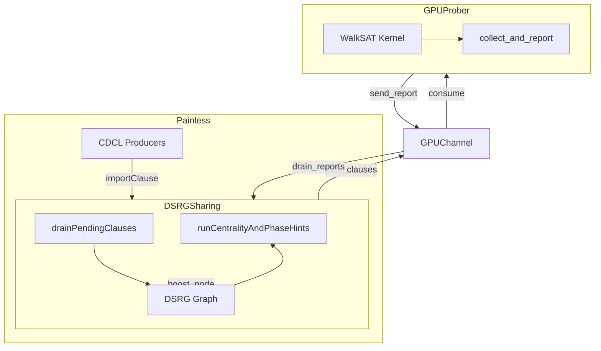

# GPU Prober 整合計畫：納入 DSRG 權重更新流程

> **狀態：已整合** — GPU probing 架構已恢復並整合至 DSRGSharing 權重更新流程，hotzone 回報作為 `boost_node` 的輸入來源。啟用方式：`-shr-strat=4 -shr-gpu`。

---

## 1. 架構概述



**資料流：**

1. **DSRGSharing → GPU：** 定期將 DSRG 的 clause 快照 push 到 GPUChannel，供 GPUProber 載入
2. **GPUProber：** 在獨立 thread 執行 WalkSAT，統計各 clause 的 unsat 次數，回報 top-K 為 hotzone（raw frequency）
3. **GPU → DSRGSharing：** `runCentralityAndPhaseHints` 內 drain reports，主程式由 frequency 計算 weight，再呼叫 `dsrg_.boost_node(clause_id, weight)`
4. **權重更新順序：** 先 drain hotzone 並 boost，再 `decay_all_weights`，接著算 centrality 與 phase hints

---

## 2. GPU Hotzone 回報：Raw Frequency，主程式計算權重

GPU 僅回報 **raw frequency**（unsat 次數），權重計算在主程式（DSRGSharing）內完成。

### 2.1 HotzoneEntry 結構

```cpp
struct HotzoneEntry {
    uint32_t clause_id;
    int      frequency;   // raw unsat count from WalkSAT
};
```

### 2.2 權重計算（主程式端，DSRGSharing）

DSRGSharing 在 drain reports 時，依 frequency 與本地 DSRG 節點屬性（length、lbd）計算權重：

| 選項 | 公式 | 說明 |
|------|------|------|
| A. 純頻率縮放 | `weight = gpu_hotzone_boost * frequency` | 最簡 |
| B. 正規化 | `weight = (frequency / max_freq) * boost` | 避免極端主導 |
| C. 長度加權 | `weight = boost * frequency / node->length` | 短 clause 較重要 |
| D. 綜合 | 依 DSRG 節點屬性組合 | 可擴充 |

**優點：** 權重公式可純在 C++ 內調整，無需改 GPU kernel；DSRG 已有節點屬性，無需額外 push metadata。

---

## 3. 需還原的元件

### 3.1 來源（git 中已刪除）

| 路徑 | 說明 |
|------|------|
| `src/comm/mpsc_queue.h` | Lock-free MPSC queue，GPUChannel 依賴 |
| `src/comm/gpu_channel.h` | GPU↔DSRGSharing 通訊（reports + clause push） |
| `src/gpu/gpu_types.h` | GPUProberConfig、FlatClauseDB、GPUReport（HotzoneEntry: clause_id, frequency） |
| `src/gpu/walksat_kernel.cu` | WalkSAT CUDA kernel |
| `src/gpu/walksat_kernel.cuh` | Kernel 參數與 launch |
| `src/gpu/gpu_prober.h` | GPUProber 類別 |
| `src/gpu/gpu_prober.cu` | GPUProber 實作 |

### 3.2 依賴調整

- `gpu_channel.h` 原本 include `comm/mpsc_queue.h`，需確保 mpsc_queue 可單獨使用（無 DeltaPatch 等）
- `gpu_prober` 使用 `GPUChannel` 與 `GPUProberConfig`，不依賴 Master/Worker

---

## 4. DSRGSharing 整合點

### 4.1 Clause 快照匯出

DSRG 目前僅存 `clause_vars_`（var_id），WalkSAT 需要完整 **literals**（含正負號）。需在 DSRGSharing 維護：

```cpp
// DSRGSharing 新增
std::unordered_map<uint32_t, std::vector<int>> dsrgIdToLiterals_;
```

- 在 `drainPendingClauses` 加入節點時，同步寫入 `dsrgIdToLiterals_[dsrg_id] = literals`
- GC 時，一併清除已 evict 節點對應的 literals

### 4.2 週期性 Push Clauses 到 GPU

在 `doSharing` 中（例如每 `gpuPushIntervalRounds` 輪）：

- 從 `dsrg_` 與 `dsrgIdToLiterals_` 組出 clause 列表（original + learnt，LBD ≤ threshold）
- 包成 `GPUClausePush`（clause_id、literals、lbd），權重在主程式由 DSRG 節點屬性計算，無需額外 metadata
- GPUProber 的 `check_new_clauses` 會 `consume_push()` 並 `load_clauses`

### 4.3 在 runCentralityAndPhaseHints 內 Drain Hotzone

調整順序：

```cpp
void DSRGSharing::runCentralityAndPhaseHints() {
    if (dsrg_.node_count() == 0) return;

    // 1. 先套用 GPU hotzone（若啟用），在主程式內由 frequency 計算 weight
    if (gpuChannel_) {
        gpuChannel_->drain_reports([this](GPUReport report) {
            float boost = dsrg_.config().gpu_hotzone_boost;
            // 範例：正規化或直接縮放（可換成 C、D 等公式）
            int maxFreq = 0;
            for (auto& e : report.hotzone) maxFreq = std::max(maxFreq, e.frequency);
            for (auto& e : report.hotzone) {
                if (!dsrg_.has_node(e.clause_id)) continue;
                float w = (maxFreq > 0) ? boost * (float)e.frequency / maxFreq : 0;
                dsrg_.boost_node(e.clause_id, w);
            }
        });
    }

    // 2. decay → centrality → aggregation → phase
    dsrg_.decay_all_weights();
    clauseCentrality_ = compute_centrality(dsrg_, centralityCfg_);
    // ... 其餘不變
}
```

### 4.4 選填參數

- `gpuPushIntervalRounds`（`-dsrg-gpu-push`）：多少輪 push 一次 clause 快照（預設 50）
- `gpu_hotzone_boost`：主程式權重公式的縮放係數
- `gpu_weight_formula`：主程式內權重計算方式（normalize / length_weighted / raw 等，可選）
- `num_walks`（YAML `gpu.num_walks`）：並行 WalkSAT 數量；0 表示依 GPU 裝置自動計算（依 SM 數、可用記憶體）

### 4.5 動態 Launch 配置

`GPUProber::compute_launch_config()` 依執行時裝置屬性決定 kernel launch 參數：

- **block_size**：固定 32（一個 warp）
- **grid_size**：`max(num_walks, num_SMs × 32) / 32`，並受 `maxGridSize`、可用記憶體（每 thread 約 `2 × num_vars` bytes）限制
- **num_walks=0**：自動 mode，預設至少 256 walks；多 SM GPU 會得到數千 walks（如 4096）

---

## 5. 生命週期與執行緒

- **GPUProber** 在獨立 `std::thread` 中執行 `run_loop()`
- **DSRGSharing** 在 Painless Sharer 的 thread 中執行 `doSharing`
- 透過 **GPUChannel**（MPSC queue + mutex）做非同步通訊，兩端不互相 block

**啟動時機：**

- 在 `SharingStrategyFactory::instantiateLocalStrategies` 建立 DSRGSharing 時，若參數 `-shr-gpu=1`（或類似）啟用：
  1. 建立 `GPUChannel`
  2. 建立 `GPUProber(config, channel)`
  3. 傳入 `shared_ptr<GPUChannel>` 給 DSRGSharing
  4. 呼叫 `gpuProber->start()`（在 portfolio 啟動後、或 DSRGSharing 建構完成後）

**結束時機：**

- `globalEnding` 時，呼叫 `gpuProber->stop()`（需在 Portfolio 或 main 持有 gpuProber 引用）

---

## 6. 與 Painless 的耦接

### 6.1 參數擴充

在 `deps/painless/src/utils/Parameters.hpp` 新增（若尚未存在）：

```cpp
PARAM(enableGpuProber, bool, "shr-gpu", false, "Enable GPU WalkSAT prober for DSRG hotzone")
```

### 6.2 DSRGSharing 建構擴充

`SharingStrategyFactory` 建 DSRGSharing 時：

- 若 `enableGpuProber`，建立 `GPUChannel` + `GPUProber`，並以額外參數傳入 DSRGSharing
- DSRGSharing 建構式增加：`std::shared_ptr<GPUChannel> gpuChannel = nullptr`
- 內部保存 `gpuChannel_`、`gpuProber_`（可選），並負責在 destructor 呼叫 `gpuProber_->stop()`

### 6.3 num_vars 取得

- GPU `load_clauses` 需要 `num_vars`
- 可從 Painless 的 `ClauseDatabase` 或第一筆 clause 推估，或由 parameters 傳入（例如 `-n` 或 instance 變數數）
- 若無則在首度 push 時從 literals 計算 `max(abs(lit))`

---

## 7. 實作順序建議

1. **Phase A：還原最低限度通訊與 GPU**
   - 還原 `mpsc_queue.h`、`gpu_channel.h`
   - 還原 `gpu_types.h`、`walksat_kernel.cu`、`walksat_kernel.cuh`、`gpu_prober.h`、`gpu_prober.cu`
   - 調整 include 與 namespace，使其不依賴已刪除的 comm 元件
   - 恢復 `gpu_lib` 與 `gpu_test`，確保可編譯、測試通過

2. **Phase B：DSRGSharing 整合**
   - 新增 `dsrgIdToLiterals_`，在 drain / GC 時維護
   - 新增 `gpuChannel_`、`gpuProber_` 為選填成員
   - 在 `runCentralityAndPhaseHints` 中 drain reports 並呼叫 `boost_node`
   - 在 `doSharing` 中週期性 push clauses

3. **Phase C：Painless 參數與生命週期**
   - 新增 `-shr-gpu` 參數
   - 在 factory 中依參數建立 GPUChannel、GPUProber 並傳給 DSRGSharing
   - 確保 `gpuProber->stop()` 在結束時被呼叫

4. **Phase D：文件與 benchmark** ✓
   - 更新 `RESEARCH_PLAN.md`、`DSRG_USAGE_SUMMARY.md`、`IMPL_DETAILS.md`
   - 跑 benchmark 比較 開/關 GPU prober 的差異

5. **Phase E：動態 Launch 配置** ✓
   - 移除寫死的 64 threads，改由 `compute_launch_config()` 依 GPU 裝置與 `num_walks` 動態計算

---

## 8. 設計注意事項

- **Clause ID 一致性：** GPU 回報的 `clause_id` 必須對應 DSRG 的 `dsrg_id`。Push 時使用 `dsrg_id` 作為 clause_id 即可。
- **GC 同步：** 被 evict 的節點不再 boost；`has_node` 檢查可避免對已刪除節點呼叫 `boost_node`。
- **空快照：** 若 DSRG 尚無節點，不 push；GPUProber 在無 clause 時 sleep，不影響主流程。
- **編譯選項：** 可考慮 `#ifdef USE_GPU_PROBER`，在無 CUDA 環境關閉 GPU 相關程式碼，使建置可選。
